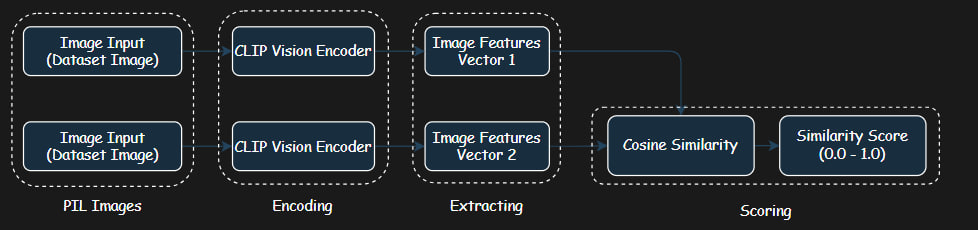
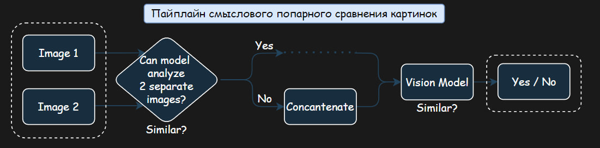
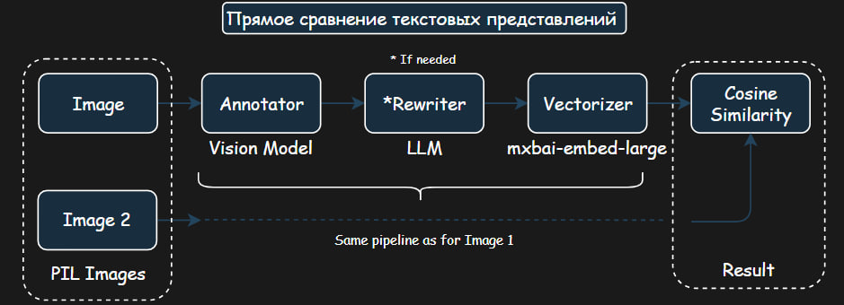
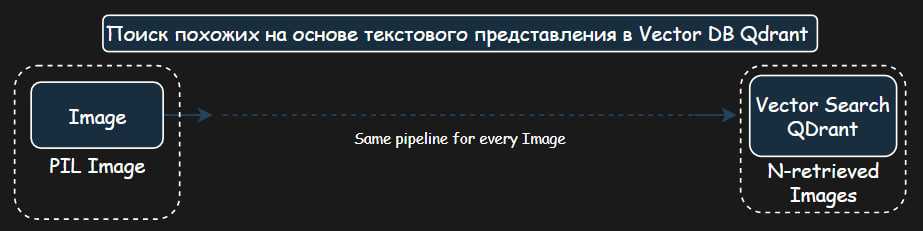
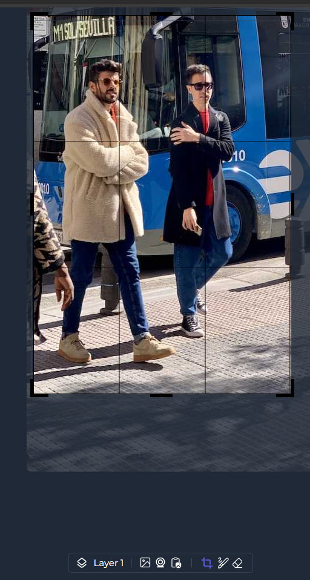
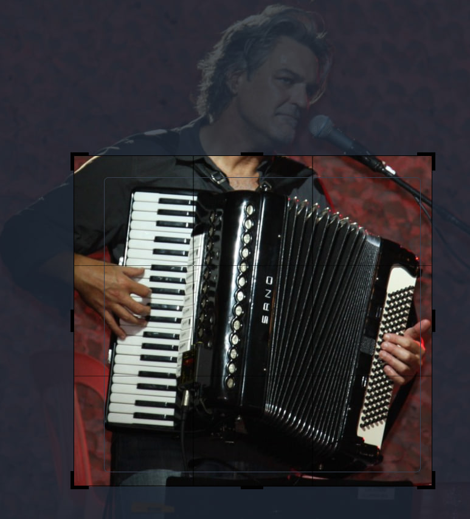
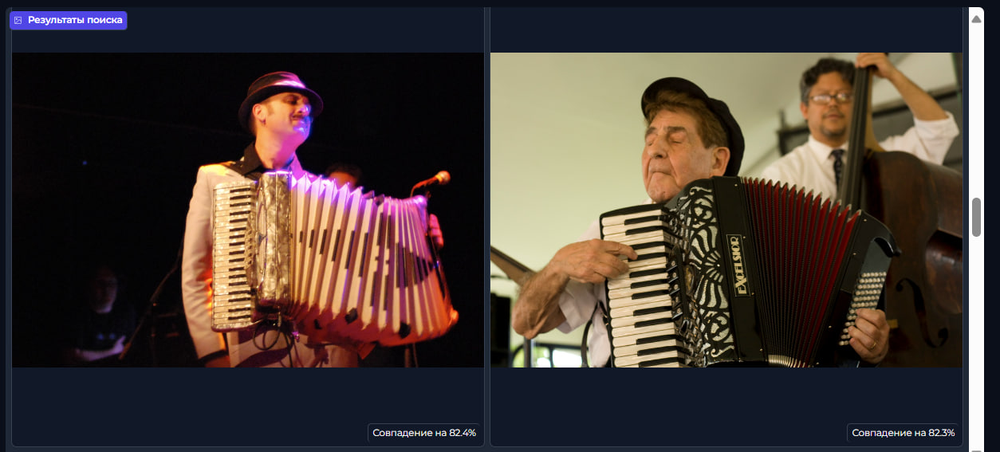

# Image Similarity Search

## Содержание
- [Обзор](#обзор)
- [Ключевые особенности](#ключевые-особенности)
- [Сравнительные преимущества](#сравнительные-преимущества)
- [Архитектура](#архитектура)
- [Начало работы](#начало-работы)
- [Команда](#команда)
- [Лицензия](#лицензия)
- [Примеры](#примеры)

 


 

## Обзор 
Система поиска смысловых копий изображений.

Проект представляет собой комплексное решение для поиска похожих изображений с использованием CLIP.

## Ключевые особенности

### 🔍 Поиск похожих изображений
- Простой и эффективный механизм сравнения изображений
- Настраиваемый порог схожести (текущий порог: 70%)
- Поддержка различных форматов изображений через PIL

### 💻 Удобный веб-интерфейс
- Построен на Gradio для быстрого прототипирования
- Встроенный редактор изображений
- Галерея результатов с процентом совпадения

### 🛠 Техническая реализация
- Python с использованием библиотеки Gradio
- Простая архитектура с возможностью расширения
- Настраиваемое логирование

### 📦 Готовность к использованию
- Простой запуск через Python
- Поддержка конфигурации через переменные окружения
- Доступ через веб-браузер (порт 8080)

## Сравнительные преимущества 

### Текущее решение: CLIP подход
<div align="center">
  
  <p><em>Архи��ектура CLIP для извлечения признаков из изображений</em></p>
</div>

1. **Извлечение признаков**
   - Каждое изображение преобразуется в эмбеддинг с помощью CLIP
   - CLIP создаёт векторные представления, учитывающие как визуальные, так и семантические особенности
   - Результат: каждая фотография представлена как вектор в многомерном пространстве

2. **Поиск похожих**
   - Вычисляется мера сходства между векторами (косинусное расстояние)
   - Находятся ближайшие соседи для заданного изображения
   - Возвращается список наиболее похожих фотографий

### Исследованные прототипы

В процессе разработки были изучены и протестированы различные подходы:

#### LLM подход

**Прямое сравнение:**
- Преобразование изображений в текстовые описания
- Создание эмбеддингов из текста
- Попарное сравнение через косинусное сходство (F1 > 0.97)

<div align="center">
  
  <p><em>Подход с использованием языковых моделей для сравнения изображений</em></p>
</div>

**Векторный поиск Qdrant:**
- Индексация: изображение → текст → эмбеддинг → Qdrant
- Поиск: изображение → текст → поиск похожих векторов

<div align="center">
  
  <p><em>Прямой подход к векторному поиску с использованием Qdrant</em></p>
</div>

<div align="center">
  
  <p><em>Архитектура векторного поиска на базе Qdrant</em></p>
</div>

#### Классические методы компьютерного зрения

В рамках исследования также были протестированы:
- SIFT для поиска ключевых точек
- CNN для извлечения признаков
- Перцептивный хеш для быстрого сравнения
- Template Matching для точного сопоставления

## Преимущества и ограничения текущего решения

✅ Преимущества:
- Понимание семантики изображений
- Работает с различными типами изображений
- Не требует дополнительного обучения

⚠️ Ограничения:
- Требует значительных вычислительных ресурсов
- Зависимость от качества CLIP эмбеддингов
- Может требовать оптимизации для больших коллекций

## Архитектура 

<div align="center">
  
  <p><em>Общая архитектура системы поиска похожих изображений</em></p>
</div>

## Начало работы: 

### 🔧 Установка и запуск

1. Клонируйте репозиторий:

```bash
git clone <repo_url>
cd <repo_name>
```

2. Создайте файл `.env` на основе `.env.example` и настройте следующие переменные:

```env
OPENAI_BASE_URL=https://my-ollama-server/api/v1   # URL Ollama сервера
OPENAI_API_BASE=https://my-ollama-server/api/v1   # URL Ollama сервера
OPENAI_API_KEY=sk-ollama-token-example            # Токен для доступа
```

3. Запустите проект с помощью Docker Compose:

```bash
docker-compose up -d
```

4. Откройте в браузере:

[`http://localhost:8080`](http://localhost:8080)

#### Вариант 2: Прямой запуск через Gradio

1. Клонируйте репозиторий:
```bash
git clone <repo_url>
cd image-filter-private
```

2. Увеличьте системный лимит дескрипторов (важно!):
```bash
ulimit -n 50000  # Без этого возможно падение при обработке изображений
```

3. Поместите изображения для анализа в директорию:
```bash
application/data
```

4. Перейдите в директорию application и запустите приложение:
```bash
cd application
python src/main.py
```

5. Откройте в браузере ссылку, которую выведет Gradio в консоли

## 📸 Примеры

### Выделение области поиска
Система позволяет выбрать конкретную область изображения для поиска похожих элементов:

<div align="center">
  
  
  <p><em>Интерфейс выделения интересующей области на изображении</em></p>
</div>

### Результаты поиска
Примеры найденных похожих изображений:

<div align="center">
  
  
  <p><em>Результаты поиска визуально схожих изображений на основе выбранной области</em></p>
</div>

## 👥 Наша Команда

### **AGI Team**

## 📝 Лицензия

Проект распространяется под лицензией GNU General Public License v3.0.